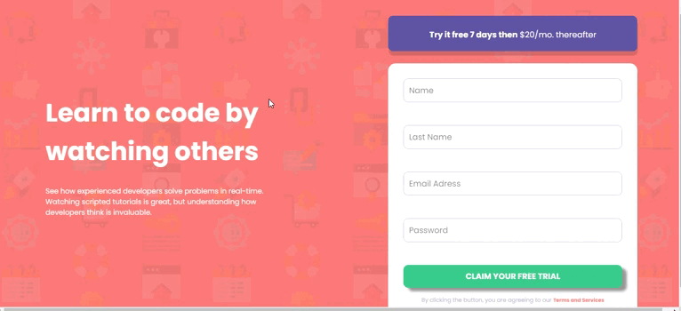

# Vturb - challenge

##  

This landing page was a project for a job I applied for and this was one of the parts of the selection process. The project was developed with HTML, CSS and JS. Effects in input and button fields. I used media query for responsiveness.

## 🚀 Result: 

<a href="https://vturb-desafio.vercel.app/">Clique aqui para acessar o projeto</a> 

## 💻 Technologies that were used:
* HTML
* CSS
* JS
